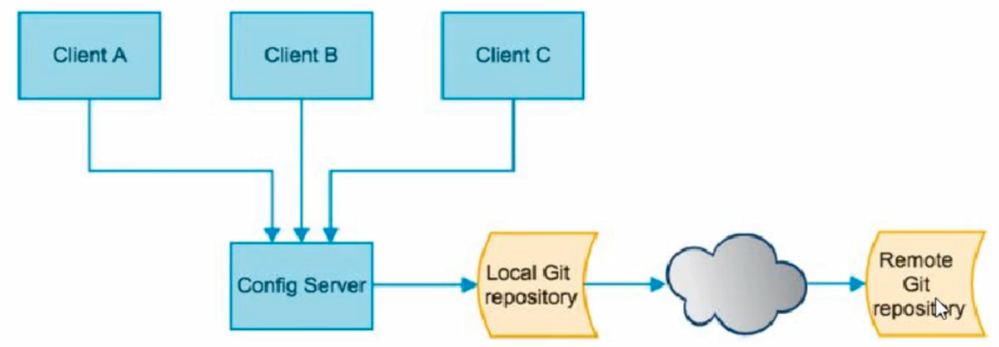
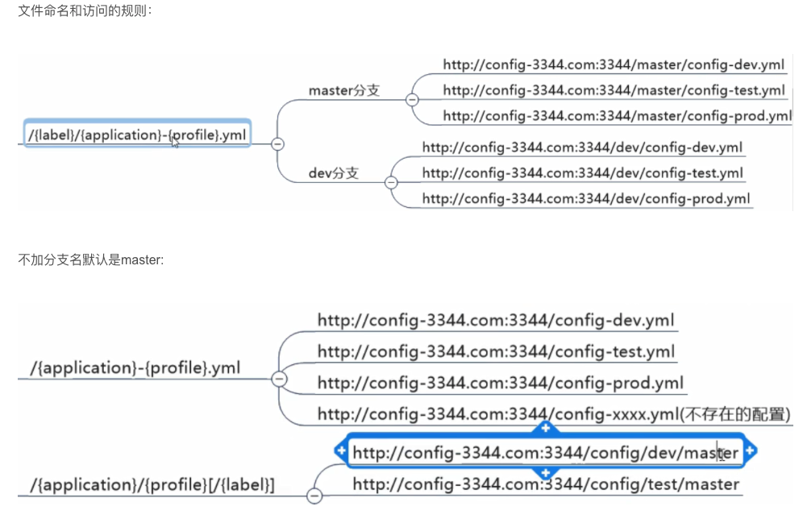
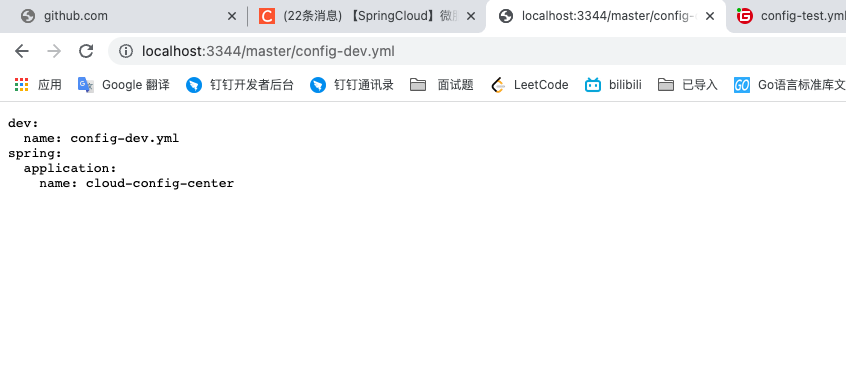
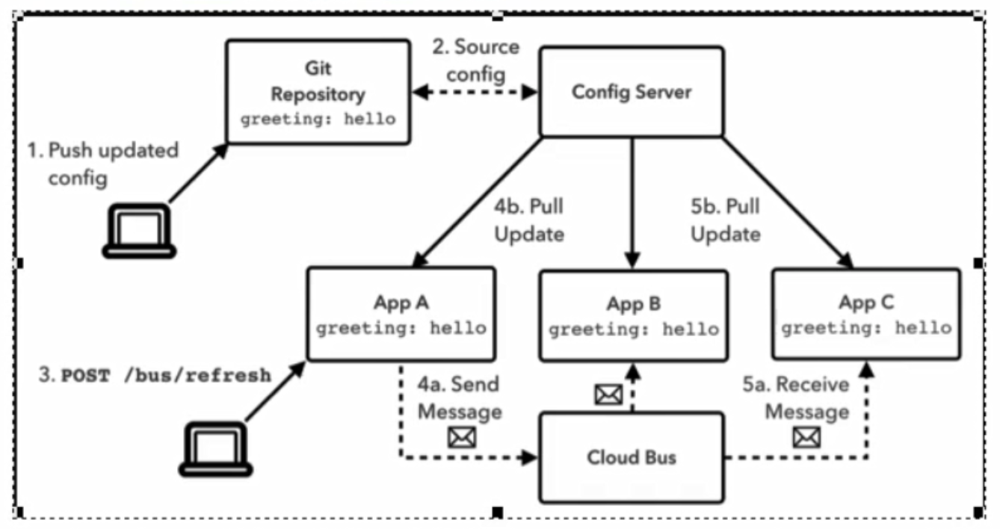
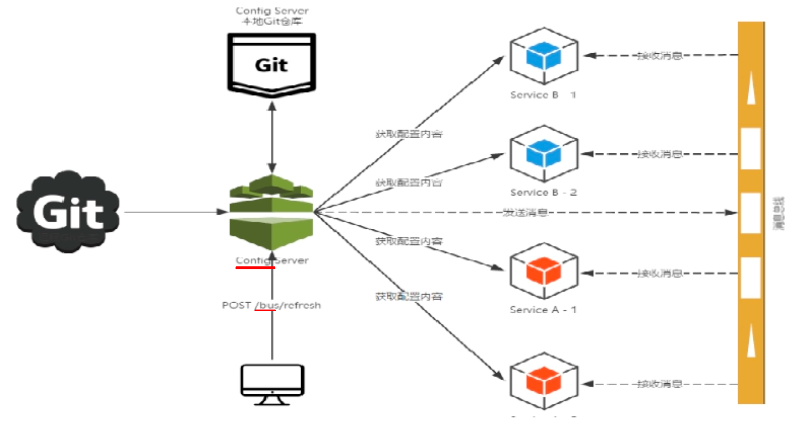
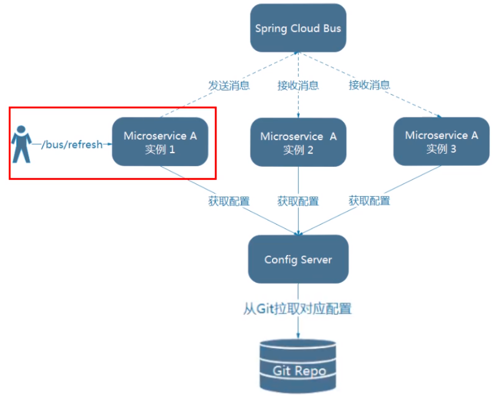
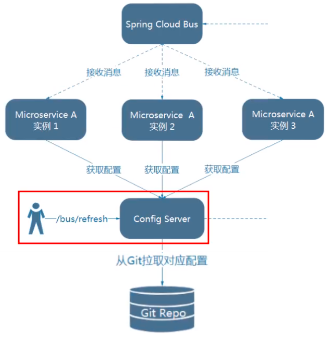

##SpringCloud Config 分布式配置中心

概述
微服务意味着要将单应用中的业务拆分成一个个子服务，每个服务的粒度相对较小，因此系统中会出现大量的服务。由于每个服务都需要必要的配置信息才能运行，所以一套集中式的、动态的配置管理设施是必不可少的。

springCloud提供了ConfigServer来解决这个问题，我们每一个微服务自己带着一个application.yml，上百个配置文件的管理。比如数据库的信息，我们可以写到一个统一的地方。

SpringCloud Config是什么：Spring Cloud Config为微服务架构中的微服务提供集中化的外部配置支持，配置服务器为各个不同微服务应用的所有环境提供了一个中心化的外部配置。

怎么玩：
SpringCloud Config分为服务端和客户端两部分。

服务端也称为分布式配置中心，它是一个独立的微服务应用，用来连接配置服务器并为客户端提供获取配置信息，加密/解密信息等访问接口
客户端则是通过指定的配置中心来管理应用资源，以及与业务相关的配置内容，并在启动的时候从配置中心取和加载配置信息配置服务器默认采用git来存储配置信息，这样就有助于对环境配置进行版本管理，并且可以通过git客户端工具来方便的管理和访问配置内容
能干嘛：

集中管理配置文件
不同环境不同配置，动态化的配置更新，分环境部署比如dev/test/prod/beta/release
运行期间动态调整配置，不再需要在每个服务部署的机器上编写配置文件，服务会向配置中心统一拉取配置自己的信息
当配置发生变动时，服务不需要重启即可感知到配置的变化并应用新的配置
将配置信息以REST接囗的形式暴露

开发环境：config-dev.yml
生产环境：config-pro.yml
测试环境：config-test.tml

##测试结果
服务端链接 3344端口
http://localhost:3344/master/config-dev.yml
客户端连接 3355端口
http://localhost:3355/configInfo 通过rest接口去访问

##消息总线 SpringCloudBus
spring cloud Bus配置spring cloud Config使用可以实现配置的动态刷新

spring cloud bus是用来将分布式系统的节点与轻量级消息系统链接起来的框架，它整合了java的事件处理机制和消息中间件的功能。

spring cloud bus目前支持RabbitMQ和Kafka（因为是主题订阅）

什么是总线

在微服务架构的系统中，通常会使用轻量级的消息代理来构建一个共用的消息主题，并让系统中所有微服务实例都连接上来。由于该主题中产生的消息会被所有实例监听和消费，所以称它为消息总线。在总线上的各个实例，都可以方便地广播一些需要让貝他连接在该主题上的实例都知道的消息。

基本原理：

ConfigClient实例都监听MQ中同一个topic主题(默认是springCloud Bus)。当一个服务刷新数据的时候，它会把这个信息放入到Topic中，这样其它监听同一topic的服务就能得到通知，然后去更新自身的配置

下图原盈利是就是给其中一台发送我们的刷新POST，他刷新完后给Bus发消息，然后Bus通过消息中间件发送给BC进行更新
第一种方式：通过客户端通知其他服务

第二种方式：通过服务端通知其他服务（建议）依赖RabbitMQ

广播式刷新配置
必须先具有良好的RabbitMQ环境
演示广播效果，增加复杂度，再以3355为模板再制作一个3366
设计思想
1）利用消息总线触发一个客户端/bus/refresh，而刷新所有客户端的配置
2）利用消息总线触发一个服务端ConfigServer的/bus/refres端点，从而刷新所有客户端的配置
客户端通知其他服务

服务端通知其他服务（建议）依赖RabbitMQ

服务端通知更为合适 原因：
图二的架构显然更加适合，图一不适合的原因如下
打破了微服务的职责单一性，因为微服务本身是业务模块，它本不应该承担配置刷新的职责
破坏了微服务各节点的对等性。
有一定的局限性“例如，微服务在迁移时，它的网络地址常常会发生变化，此时如果想要做到自动刷新，那就会增加更多的
给cloud-config-center-3344配置中心服务端添加消息总线支持
给cloud-config-client-3355客户端添加消息总线支持

##测试
一次修改，广播通知，出处生效
但还是得发一个POST请求，只不过只给config发而已

可在github上修改yml文件进行测试，修改完文件，向 config server 发送 请求：

给3344发就能全局同步了【curl -X POST “http://localhost:3344/actuator/bus-refresh”】

注意，之前是向config client 一个个发送请求，但是这次是向 config Server 发送请求，而所有的config client 的配置也都全部更新

##定点通知
新的需求：指定具体某一个实例（的参数）生效而不是全部，一些是最新值，一些是旧值

公式：http://localhost:配置中心的端口号/actuator/bus-refresh/{destination}

例子：curl -X POST "http//localhost:3344/actuator/bus-refresh/config-client:3355

config-client:3355 即微服务名称+端囗号

/bus/refresh请求不再发送到具体的服务实例上，而是发给configserver并通过destination参数类指定需要更新配置的服务或实例

我们这里以刷新运行在3355端口上的config-client为例

只通知3355
不通知3366（没建这个模块）
