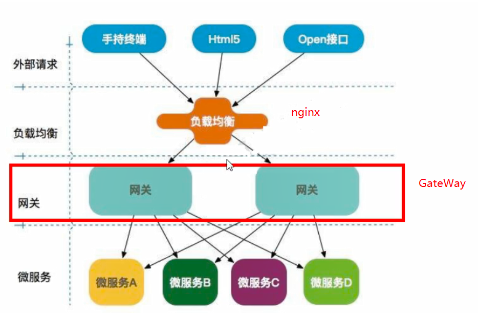
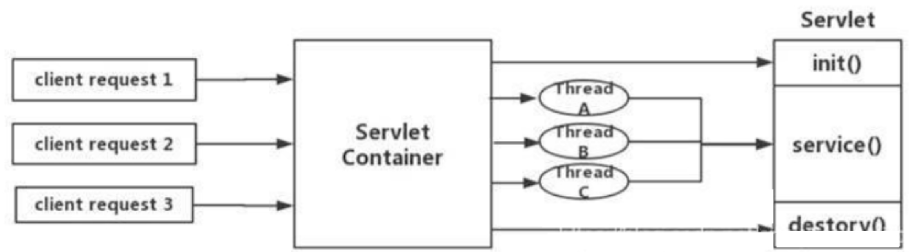
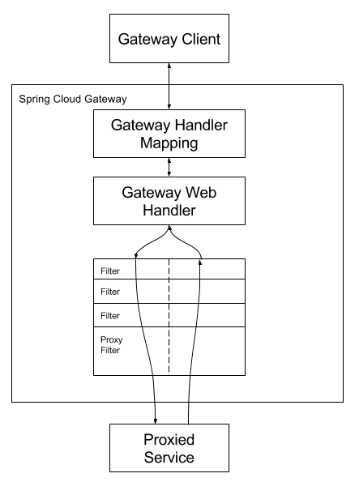

SpringCloud Gateway是SpringCloud的一个全新项目，基于Spring5.O+Springboot 2.0和ProjectReactor等技术开发的网关，它旨在为微服务架构提供一种简单有效的统一的API路由管理方式。

SpringCloudGateway作为SpringCloud生态系统中的网关，目标是替代Zuul,在SpringCloud2.0以上版本中，没有对新版本的zuul2.0以上最新高性能版本进行集成，仍然还是使用的Zuul 1.x非Reactor模式的老版本。而为了提升网关的性能，SpringCloud Gateway是基于WebFlux框架实现的，而webFlux框架底层则使用了高性能的Reactor模式通信框架Netty。

springCloudGateway的目标提供统一的路由方式且基于Filter链的方式提供了网关基本的功能，例如：安全，监控/指标，和限流。

一方面因为Zuul 1.0已经进入了维护阶段，而且Gateway是SpringCloud团队研发的是亲儿子产品，值得信赖。而且很多功能比zull用起来都简单便捷。

Gateway是基于异步非阻塞模型上进行开发的，性能方面不需要担心。虽然Netflix早就发布了最新的Zuul2.x，但Spring Cloud貌似没有整合计划。而且Netflix相关组件都宣布进入维护期；不知前景如何？

多方面综合考虑Gateway是很理想的网关选择。

SpringCloudGateway与Zuul的区别：

在SpringCloudFinchley正式版之前，SpringCloud推荐的网关是Netflix提供的Zuul：

1、Zuul 1.x是一个基于阻塞I/O的APIGateway
2、Zuul 1.x基于ServIet2.5使用阻塞架构，它不支持任何长连接（如WebSocket)，Zuul的设计模式和Nginx较像，每次I/O操作都是从
工作线程中选择一个执行，请求线程阻塞到工作线程完成，但是差别是Nginx用C++实现，Zuul用Java实现，而JVM本身会有第一次加载较慢的情况，使得Zuul的性能相对较差。
3、Zuul 2.x理念更先进想基于Netty非阻塞和支持长连接，但SpringCloud目前还没有整合。Zuul2.x的性能较Zuul1.x有较大提升。在性能方面，根据官方提供的基准测试，SpringCloudGateway的RPS（每秒请求数）是Zuul的1.6倍。
4、SpringCloudGateway建立在SpringFramework5、ProjectReactor和SpringB00t2．之上，使用非阻塞API
5、SpringCloudGateway还支持WebSocket,并且与Spring紧密集成拥有更好的开发体验
Zuull.x
springcloud中所集成的zuul版本，采用的是tomcat容器，使用的是传统的servlet IO处理模型。

学过尚硅谷web中期课程都知道一个题目，Servlet的生命周期，servlet由servlet container进行生命周期管理

container启动时构造servlet对象并调用servlet init()进行初始化，
container运行时接受请求，并为每个请求分配一个线程（一般从线程池中获取空闲线程）然后调用service()
container关闭时调用servlet destory()销毁servlet

上述模式的缺点：

servlete—个简单的网络IO模型，当请求进入servlet container时，servlet container就会为其绑定一个线程在并发不高的场景下这种模型是适用的。但是一旦高并发（比如抽风用jemeter压),线程数量就会上涨，而线程资源代价是昂贵的（上线文切换，内存消耗大）严重影响请求的处理时间。

在一些简单业务场景下，不希望为每个request分配一个线程，只需要1个或几个线程就能应对极大并发的请求，这种业务场景下servlet模型没有优势

所以Zuul 1.x是基于servlet之上的一个阻塞式处理模型，即spring实现了处理所有request请求的一个servlet(DispatcherServlet)并由该servlet阻塞式处理处理。所以springcloudzuul无法摆脱servlet模型的弊端。

传统的Web框架比如说：struts2,springmvc等都是基于Servlet API与Servlet容器基础之上运行的。

但是，在Servlet3.1之后有了异步非阻塞的支持。而WebFlux是一个典型非阻塞异步的框架，它的核心是基于Reactor的相关API实现的。相对于传统的web框架来说，它可以运行在诸如Netty，Undertow及支持Servlet3.1的容器上。非阻塞式+函数式编程(Spring5必须让你使
用java8)

SpringWebFlux是Spring5.0引入的新的响应式框架区别于SpringMVC,它不需要依赖ServletAPI，它是完全异步非阻塞的，并且基于Reactor来实现响应式流规范。

Gateway是什么
Gateway特性：

基于SpringFramework5，ProjectReactor和SpringBoot 2.0进行构建；
动态路由：能够匹任何请求属性；
可以对路由指定Predicate（断言）和Filter（过滤器）·
集成Hystrix的断路器功能；
集成SpringCloud服务发现功能；
易于编写的Predicate（断言）和Filter（过滤器）·
请求限流功能；
支持路径重写。
GateWay的三大核心概念：

Route(路由）：路由是构建网关的基本模块，它由ID、目标URI、一系列的断言和过滤器组成，如果断言为true则匹配该路由
Predicate(断言）：参考的是Java8的java.util.function.predicate。开发人员可以匹配HTTP请求中的所有内容（例如请求头或请求参数），如果请求与断言相匹配则进行路由
匹配条件
Filter(过滤）：指的是spring框架中GatewayFilter的实例，使用过滤器，可以在请求被路由前或者之后对请求进行修改。
例子：通过断言虽然进来了，但老师要罚站10min（过滤器操作），然后才能正常坐下听课

客户端向Spring Cloud Gateway发出请求。然后在Gateway HandlerMapping中找到与请求相匹配的路由，将其发送到Gateway Web Handler

Handler再通过指定的过滤器链来将请求发送到我们实际的服务执行业务逻辑，然后返回。

过滤器之间用虚线分开是因为过滤器可能会在发送代理请求之前（Pre）或之后（post）执行业务逻辑。

Filter在pre类型的过滤器可以做参数校验，权限校验，流量监听，日志输出，协议转换等，

在post类型的过滤器中可以做响应内容、响应头的修改，日志的输出，流量监控等有着非常重要的作用。
