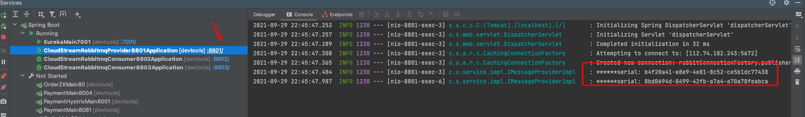
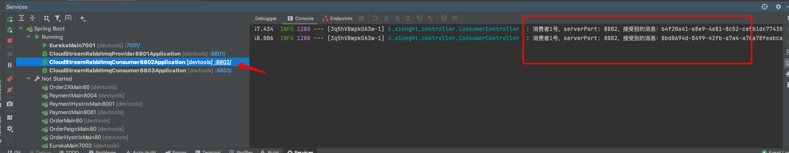
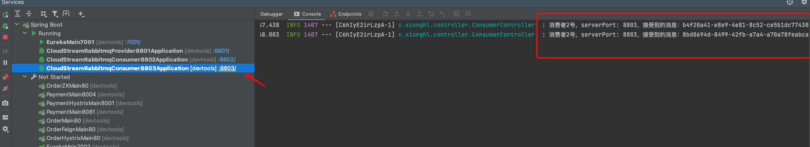
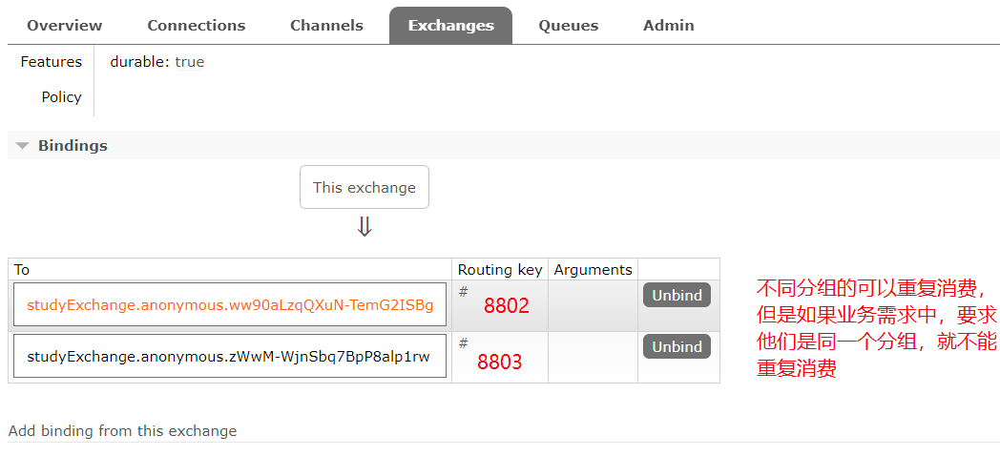
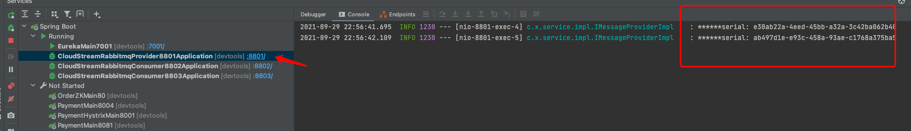
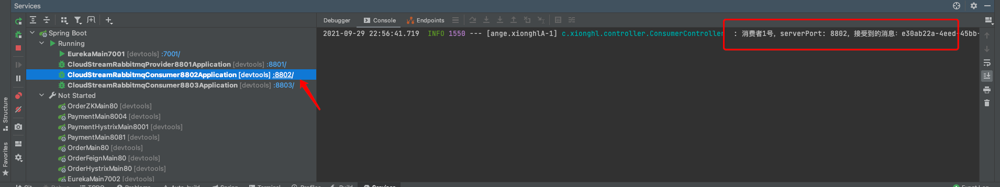
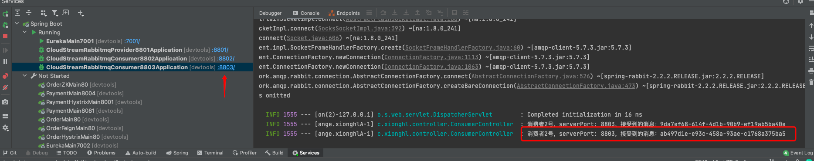

作为消费者进行发消息模块

验证消息重复消费问题 消息持久化问题  依靠分组group解决问题

##存在问题  当8801发送两条消息 被8802和8803同时消费
8801发送消息

8802接受到消息

8803也接受到了消息

意思就是说当我们订单系统做了集群后，都会从rabbitmq获取订单消息
如果一个订单被两个服务获取到 会造成数据错误

##解决
注意在stream中处同一个group中的多个消费者是竞争关系，就能保证消息只会被其中一个应用消费一次。

不同组是可以全面消费（重复消费）的

同一组内会发生竞争关系，只有其中一个可以消费。

Stream默认不同的微服务是不同的组

对于重复消费这种问题，导致的原因是默认每个微服务是不同的group，组流水号不一样，所以被认为是不同组，两个都可以消费。

解决的办法就是自定义配置分组：

当两个消费者配置的 group 都为 xionghlA 时，就属于同一组，就不会被重复消费。（两个消费者消费同一队列）

8801只消费了一条

8802也只消费了一条

##消息持久化
加上group配置，就已经实现了消息的持久化。

