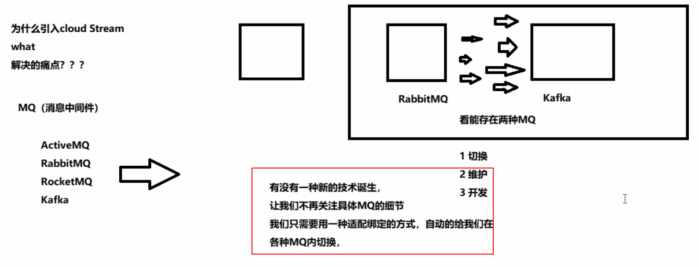
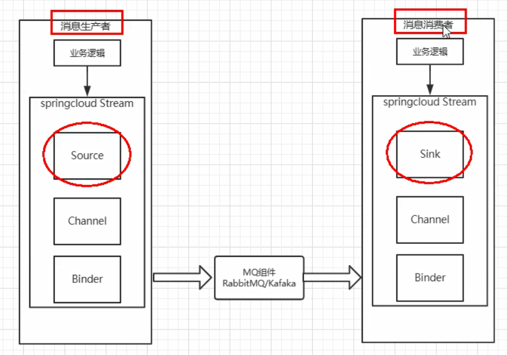
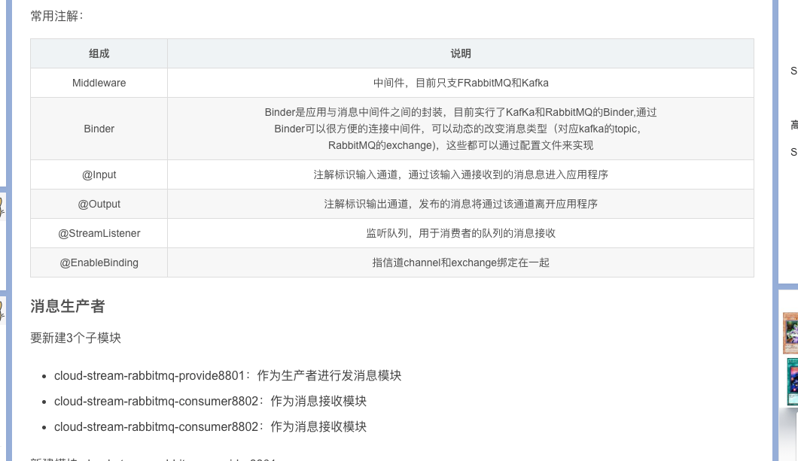

作为生产者进行发消息模块

需求：消息中间件很多，希望向上抽象一个接口，我们不关心底层用的是什么消息中间件

屏蔽底层消息中间件的差异，降低切换成本，统一消息的编程模型

就像 JDBC 形成一种规范，统一不同数据库的接口

什么是SpringCloud Stream

官方定义SpringCloud Stream是一个构建消息驱动微服务的框架。https://spring.io/projects/spring-cloud-stream#overview

应用程序通过inputs或者outputs来与SpringCloud Stream中binder对象（绑定器）交互

涌过我们配置来binding（绑定）而SpringCloud Stream的binder对象负责与消息中间件交互。

所以，我们只需要搞清楚如何与springCloudstrearn交互就可以方便使用消息驱动的方式。

通过使用Spring Integration来连接消息代理中间件以实现消息事件驱动。

SpringCloud Stream为一些供应商的消息中间件产品提供了个性化的自动化配置实现，引用了发布-订阅、消费组、分区的三个核心概念

目前仅支持RabbitMQ、Kafka。

Stream标准流程套路：

binder：很方便的连接中间件，屏蔽差异
Channel：通道，是队列Queue的一种抽象，在消息通讯系统中就是实现存储和转发的媒介，通过channel对队列进行配置
Source（生产）和sink（消费）：简单地可理解为参照对象是spring cloud stream自身，从stream发布消息就是输出，接收消息就是输入

