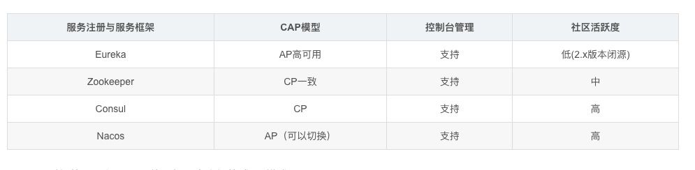
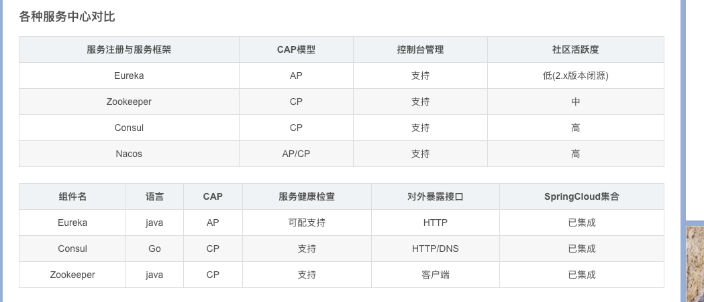
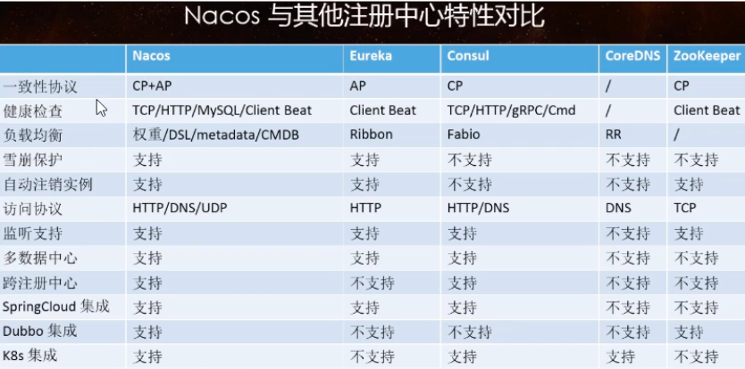
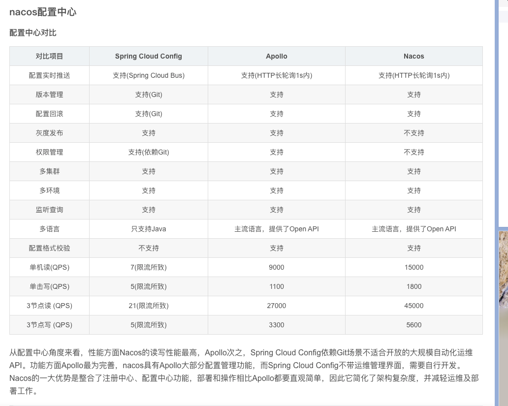

nacos提供者

NACOS支持CP和AP切换

C要求一致性，A要求可用性。

何时选择使用何种模式？

一般来说，

如果不需要存储服级的信息且服务实例是通过nacos-client注册，并能够保持心跳上报，那么就可以选择AP模式。当前主流的服务如Spring cloud和Dubbo服务，都适用于AP模式，AP模式为了服务的可用性而减弱了一致性，因此AP模式下只支持注册临时实例。

如果需要在服务级别编辑或者存储配置信息，那么CP是必须，K8S服务和DNS服务则适用于CP模式。

CP模式下则支持注册持久化实例，此时则是以Raft协议为集群运行模式，该模式下汪册实例之前须先注册服务，如果服务不存在，则会返回错误

切换命令：curl -X PUT '$NACOS_SERVER:8848/nacos/v1/ns/operator/switches?entry=serverMode&value=CP'

Nacos 自带负载均衡机制(因为自带ribbon)，下面创建第二个提供者9003。也可以-Dserver.port=9011

