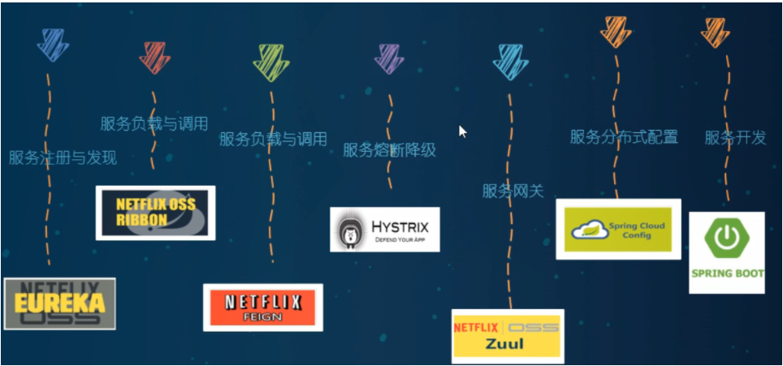
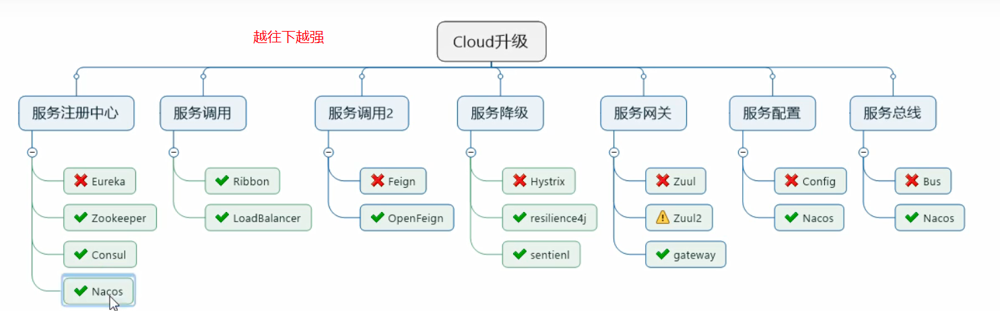

##什么是微服务架构

SpringCloud 是微服务一站式服务解决方案，微服务全家桶。它是微服务开发的主流技术栈。它采用了名称，而非数字版本号。

SpringCloud 和 springCloud Alibaba 目前是最主流的微服务框架组合
版本选择：

>选用 springboot 和 springCloud 版本有约束，不按照它的约束会有冲突。
> cloud版本决定了boot版本


查看版本对应关系：https://start.spring.io/actuator/info

```json
[{
	"traceId": "e73bd99edbb69d11",
	"parentId": "e73bd99edbb69d11",
	"id": "688aa8b95c8f414b",
	"kind": "CLIENT",
	"name": "get",
	"timestamp": 1632956109106566,
	"duration": 139241,
	"localEndpoint": {
		"serviceName": "cloud-order-service",
		"ipv4": "192.168.0.4"
	},
	"tags": {
		"http.method": "GET",
		"http.path": "/payment/zipkin/"
	}
}, {
	"traceId": "e73bd99edbb69d11",
	"id": "e73bd99edbb69d11",
	"kind": "SERVER",
	"name": "get /payment/zipkin/",
	"timestamp": 1632956109057498,
	"duration": 220994,
	"localEndpoint": {
		"serviceName": "cloud-order-service",
		"ipv4": "192.168.0.4"
	},
	"remoteEndpoint": {
		"ipv6": "::1",
		"port": 52880
	},
	"tags": {
		"http.method": "GET",
		"http.path": "/payment/zipkin/",
		"mvc.controller.class": "OrderController",
		"mvc.controller.method": "paymentZipkin"
	}
}, {
	"traceId": "e73bd99edbb69d11",
	"parentId": "e73bd99edbb69d11",
	"id": "688aa8b95c8f414b",
	"kind": "SERVER",
	"name": "get /payment/zipkin/",
	"timestamp": 1632956109185036,
	"duration": 64827,
	"localEndpoint": {
		"serviceName": "cloud-provider-service",
		"ipv4": "192.168.0.4"
	},
	"remoteEndpoint": {
		"ipv4": "127.0.0.1",
		"port": 52883
	},
	"tags": {
		"http.method": "GET",
		"http.path": "/payment/zipkin/",
		"mvc.controller.class": "PaymentController",
		"mvc.controller.method": "paymentZipkin"
	},
	"shared": true
}]
```
##微服务停更说明
1,Eureka停用,可以使用zk作为服务注册中心

2,服务调用,Ribbon准备停更,代替为LoadBalance

3,Feign改为OpenFeign

4,Hystrix停更,改为resilence4j

​ 或者阿里巴巴的sentienl

5.Zuul改为gateway

6,服务配置Config改为 Nacos

7,服务总线Bus改为Nacos


